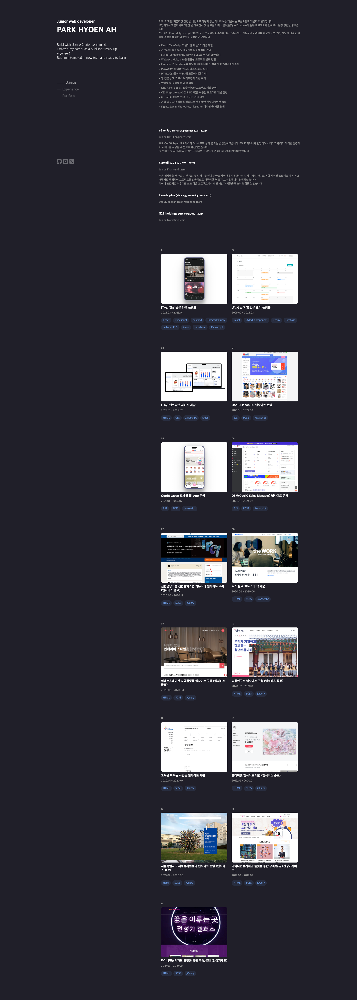

# 개인 포트폴리오 사이트

## 배포 링크

[프로젝트 바로가기](pha1155.github.io)

## 설치

```bash
npm install
```

## 실행

```bash
npm run dev
```

## 결과물 확인

dist/index.html 파일을 브라우저에서 열면 됩니다.

## 사용 기술

- EJS (HTML 대신 사용한 템플릿 엔진)
- SCSS
- Vanilla JavaScript
- Webpack (번들러)
- JSON (데이터 생성 및 EJS와 연동)

## 폴더 구조

src/ : 개발 소스<br>
dist/ : 최종 결과물

## 실행 화면


